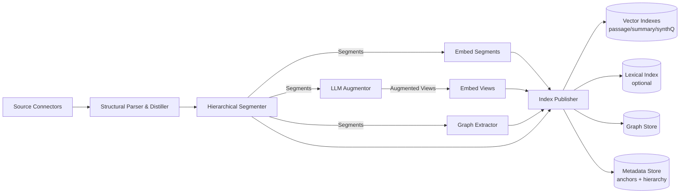

Below is a build specification for **Phase 1: Knowledge Representation Pipeline** for an internal-document RAG system. It's written as an implementation-oriented spec (logical components; deploy shape is out of scope).

# Phase 1 Specification: Knowledge Representation Pipeline

**Status:** Verified
**Last verified:** 2026-03-05

## 1. Purpose

Transform raw internal documents into **multi-view, queryable representations**:

- **Structured canonical text** with stable anchors for citation
- **Hierarchical segmentation** (Document -> Section -> Passage)
- **Augmented views** (summaries, synthetic questions, optional key points)
- **Graph evidence** (entities/relations linked to anchors)
- **Embeddings** for segments and augmented views
- **Published indexes/stores** (vector, lexical optional, graph, metadata)

Non-goals: runtime orchestration, caching/latency, retries, A/B rollout mechanics.

## 2. Inputs, outputs, and invariants
### Inputs

- Internal sources (wiki/drive/git/tickets/DB exports) accessible via connectors.
- Source metadata:
    - stable document identifier (or derivable)
    - URL (or internal reference)
    - timestamps (created/updated)
    - ACL scope (opaque is fine; must be stored)

### Outputs (published knowledge layer)

- Vector indexes (multi-view): `passage`, `summary`, `synth_question`
- Optional lexical index (BM25-style): titles, headings, identifiers, error codes
- Graph store: entities/relations with evidence references
- Metadata store: hierarchy pointers + anchors + doc metadata + artifact metadata

### Invariants

1. **Stable identity**
    - `doc_id` is stable across re-ingestion.
    - `segment_id` stable _within a doc version_; when content changes, it may change but must remain traceable.
2. **Anchorability**
    - Every segment and derived artifact must reference anchors that resolve back to the source doc.
3. **Hierarchical integrity**
    - Parent-child relationships form a DAG tree (no cycles).
4. **Deterministic segmentation (given same inputs)**
    - Parser + segmenter should produce identical results for identical doc content.

## 3. Component responsibilities
### 3.1 Source Connectors

**Goal:** fetch raw content + metadata consistently.

**Responsibilities**

- Enumerate docs (list) and fetch doc content
- Produce `RawDocument`
- Support incremental mode via:
    - change events (preferred) or polling comparisons by `updated_at`/hash

**Output contract**

```json
{
  "doc_id": "string",
  "source": "confluence|gdrive|git|jira|...",
  "source_ref": "string",
  "url": "string",
  "content_bytes": "bytes",
  "content_type": "text/html|text/markdown|application/pdf|text/plain|...",
  "metadata": { "title": "string", "...": "..." },
  "acl_scope": { "...": "opaque" },
  "timestamps": { "created_at": "...", "updated_at": "..." }
}
```

### 3.2 Structural Parser & Distiller

**Goal:** canonicalize formats into structured text.

**Responsibilities**

- Convert to canonical text (UTF-8)
- Extract structure tree:
    - headings and levels (H1/H2/...)
    - lists
    - tables (preserve row/col headers)
    - code blocks (language, boundaries)
- Generate anchors:
    - document-level anchor (`doc_anchor`)
    - section anchors (`sec_anchor`) based on path or stable IDs
    - passage anchors (`pass_anchor`) based on section + offset range

**Output contract**

```json
{
  "doc_id": "string",
  "title": "string",
  "canonical_text": "string",
  "structure_tree": { "type": "doc", "children": [ ... ] },
  "anchors": {
    "doc": "anchor_ref",
    "sections": [{ "path": "H1>H2", "anchor": "anchor_ref" }],
    "blocks": [{ "type": "table|code|para", "anchor": "anchor_ref", "range": [0, 1200] }]
  },
  "metadata": { "...": "..." }
}
```

**Parsing rules (minimum)**

- Preserve heading text and order.
- For tables: include a serialization that retains headers (e.g., Markdown table with header row).
- For code blocks: preserve verbatim text; avoid wrapping/normalizing whitespace beyond newline normalization.

### 3.3 Hierarchical Segmenter

**Goal:** create nested retrieval units for later auto-merge.

**Segmentation policy**

- Levels:
    - `SECTION` node: based on heading boundaries
    - `PASSAGE` node: within a section, split into passages of target size
- Target passage size: **300-800 tokens** (configurable), overlap optional (0-15%)
- Special handling:
    - Tables: keep whole table as one passage if feasible; otherwise split by row groups with header repetition.
    - Code: keep function/class blocks when possible; otherwise split by logical boundaries.

**Output contract**

```json
{
  "segments": [
    {
      "segment_id": "string",
      "doc_id": "string",
      "type": "SECTION|PASSAGE",
      "parent_id": "string|null",
      "section_path": "H1>H2>...",
      "anchor": "anchor_ref",
      "text": "string",
      "token_count": 123,
      "metadata": { "block_types": ["para","table"], "language": "python" }
    }
  ]
}
```

### 3.4 LLM Augmentor

**Goal:** create auxiliary views that improve retrieval alignment and synthesis.

**Artifacts**

- `summary` (for SECTION or PASSAGE)
- `synth_question` (typically 3-10 per SECTION; configurable)
- optional `key_points` (5-10 bullets per SECTION)

**Constraints**

- Each augmented view must reference `source_segment_id`.
- Store generation metadata:
    - model id/version, prompt template id, created_at

**Output contract**

```json
{
  "views": [
    {
      "view_id": "string",
      "view_type": "summary|synth_question|key_points",
      "text": "string",
      "source_segment_id": "string",
      "generation_metadata": {
        "model": "string",
        "model_version": "string",
        "prompt_id": "string",
        "created_at": "timestamp"
      }
    }
  ]
}
```

**Prompt requirements (minimum)**

- Summary prompt: factual, extractive-leaning, preserve named entities/IDs.
- Synthetic questions: diverse intents (definition, procedure, troubleshooting, "where is X configured", etc.), avoid hallucinating beyond source.

### 3.5 Graph Extractor (GraphRAG prep)

**Goal:** extract entity/relation layer for topological retrieval.

**Entity schema (minimum)**

- `type`: service, API, component, team, policy, metric, dataset, repository, environment, etc.
- `aliases`: alternate names/acronyms
- `evidence_refs`: anchor refs or segment IDs

**Relation schema (minimum)**

- `rel_type`: depends_on, owned_by, calls, produces, consumes, defines, located_in, replaces, configured_by, etc.
- Evidence references required for each edge.

**Output contract**

```json
{
  "entities": [
    { "entity_id": "string", "name": "string", "type": "string", "aliases": ["..."], "evidence_refs": ["anchor_ref"] }
  ],
  "relations": [
    { "edge_id": "string", "src_entity_id": "string", "rel_type": "string", "dst_entity_id": "string", "evidence_refs": ["anchor_ref"], "confidence": 0.0 }
  ],
  "extraction_metadata": { "model": "string", "prompt_id": "string", "created_at": "timestamp" }
}
```

**Identity resolution**

- Phase 1 can do lightweight canonicalization:
    - normalize casing/punctuation
    - map known aliases via dictionary
- Full entity resolution across sources can be iterative; must at least keep aliases.

### 3.6 Semantic & Relational Encoder

**Goal:** produce embeddings for retrieval across multiple views.

**Embedding targets**

- `segment(PASSAGE)` (required)
- `segment(SECTION)` (optional but useful for hierarchical retrieval)
- `AugmentedView(summary)` (recommended)
- `AugmentedView(synth_question)` (recommended)

**Output contract**

```json
{
  "embeddings": [
    {
      "item_id": "string",
      "item_type": "passage|section|summary_view|synth_question_view",
      "vector": [0.123, 0.456],
      "model_id": "string",
      "model_version": "string",
      "created_at": "timestamp"
    }
  ]
}
```

### 3.7 Index Publisher

**Goal:** write the final knowledge representations to stores.

**Stores**

1. **Vector Indexes**
    - separate indexes or a single index with `item_type` filter
2. **Lexical Index (optional)**
    - doc title, headings, identifiers
3. **Graph Store**
    - nodes/edges; support traversal queries by entity id/type
4. **Metadata Store**
    - segment text, hierarchy pointers, anchors, URLs, timestamps, ACL scope
    - augmented view text + metadata
    - doc-level metadata

**Publishing requirements**

- Idempotent upserts by `item_id`
- Deletions/tombstones for removed segments/views/edges
- Store cross-references:
    - `segment_id -> doc_id, parent_id, anchor, section_path`
    - `view_id -> source_segment_id`
    - `embedding.item_id -> stored text object`

## 4. Pipeline control flow
### 4.1 End-to-end DAG (conceptual)

1. `Connect` -> `Parse` -> `Segment`
2. `Segment` branches to:
    - `Augment` -> `Embed(views)`
    - `ExtractGraph`
    - `Embed(segments)`
3. `Publish` everything to stores

### 4.2 Incremental refresh logic (conceptual)

- Identify changed docs (event/poll)
- For each changed doc:
    - regenerate parse + segments for that doc version
    - regenerate augmented views (or selectively for changed sections)
    - regenerate graph evidence (or selectively)
    - re-embed impacted items
    - publish upserts + tombstones for removed items

## 5. Configuration surface (Phase 1)

Minimum configuration object:

```yaml
sources:
  - type: confluence
    include_spaces: [...]
  - type: git
    repos: [...]
parsing:
  preserve_tables: true
  preserve_code_blocks: true
segmentation:
  passage_tokens_target: 600
  passage_tokens_min: 300
  passage_tokens_max: 900
  overlap_ratio: 0.10
augmentation:
  summaries:
    enabled: true
    target: SECTION
  synthetic_questions:
    enabled: true
    per_section: 6
graph_extraction:
  enabled: true
  entity_types: [service, api, team, policy, component, metric]
  relation_types: [depends_on, owned_by, calls, defines, configured_by]
embedding:
  model_id: "..."
publishing:
  vector_index_mode: "multi"   # multi-view indexes
  lexical_index: true
```

## 6. Quality checks (Phase 1 acceptance criteria)
### Parser/structure checks

- ≥ 99% docs produce non-empty `canonical_text`
- heading hierarchy extracted where present
- tables and code blocks preserved and tagged

### Segmentation checks

- each PASSAGE has:
    - `doc_id`, `segment_id`, `anchor`, `parent_id` (section)
- token_count in configured bounds for ≥ 95% passages (exceptions: tables/code)

### Augmentation checks

- summaries present for ≥ X% of sections
- synth questions per section within configured bounds
- generation metadata present

### Graph extraction checks

- entities/relations always include `evidence_refs`
- relations refer to valid entity IDs
- extraction metadata present

### Publishing checks

- referential integrity:
    - every embedding item_id exists in metadata store
    - every view points to existing segment
    - every evidence_ref resolves to an anchor/segment

## 7. Observability events (conceptual)

Even ignoring ops mechanics, define the event vocabulary:

- `DocFetched(doc_id, updated_at)`
- `DocParsed(doc_id, anchors_count, structure_nodes)`
- `DocSegmented(doc_id, sections, passages)`
- `ViewsGenerated(doc_id, summaries, synth_questions)`
- `GraphExtracted(doc_id, entities, edges)`
- `EmbeddingsCreated(doc_id, count, model_version)`
- `Published(doc_id, upserts, tombstones)`
- `PipelineError(stage, doc_id, error_class)`

## 8. Mermaid: Phase 1 pipeline diagram



## 9. Implementation milestones
### M1 -- Corpus ingestion + canonical parsing

- Implement connectors for 1-2 sources
- Produce `RawDocument`, `ParsedDocument`
- Validate anchors and structure extraction

### M2 -- Hierarchical segmentation + metadata store

- Implement segmenter and store segments + hierarchy pointers
- Achieve stable anchors for citation

### M3 -- Embeddings + vector index (passage view)

- Embed PASSAGE segments and publish to vector store
- End-to-end "retrieve passage by embedding" demo

### M4 -- Augmented views (summary + synthetic questions)

- Generate and store views + embed them
- Publish into multi-view vector indexes

### M5 -- Graph extraction + graph store

- Entity/relation extraction with evidence refs
- Publish nodes/edges; validate referential integrity

### M6 -- Index publisher hardening (integrity + tombstones)

- Idempotent upserts, deletions, cross-reference checks
- Acceptance criteria and validation reports
